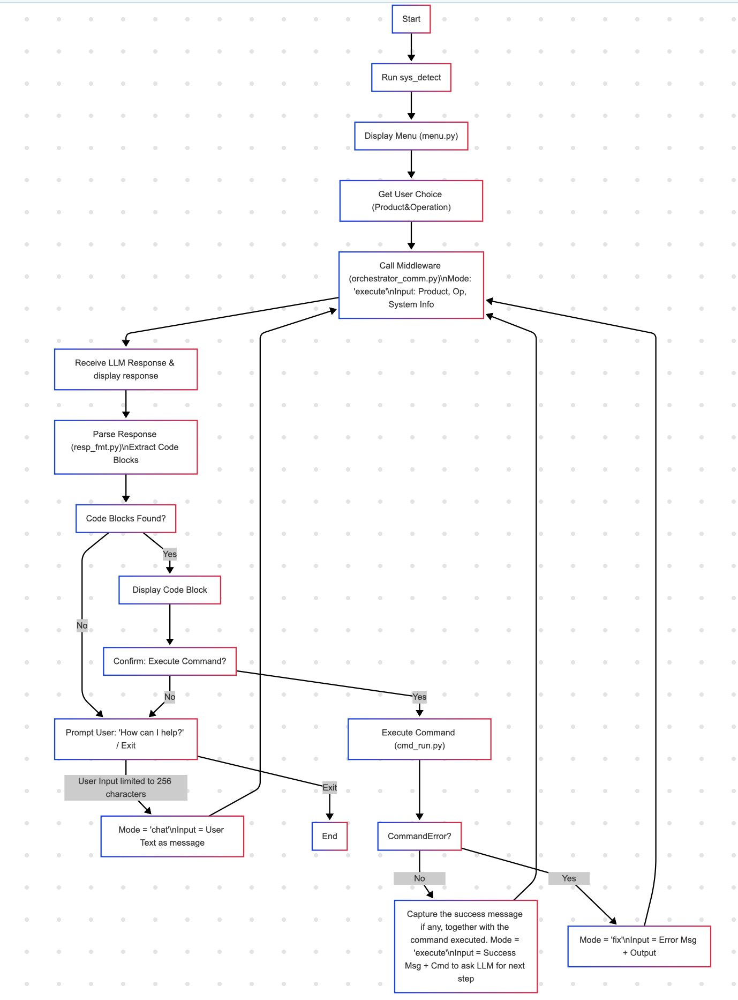

# helloworld-click-client
 
```bash
uv init

uv add click

```

The flowchart

```
flowchart TD
    A[Start] --> B["Run sys_detect"]
    B --> C["Display Menu (menu.py)"]
    C --> D["Get User Choice (Product&Operation)"]
    D --> E["Call Middleware (orchestrator_comm.py)\nMode: 'execute'\nInput: Product, Op, System Info"]
    E --> F["Receive LLM Response & display response"]
    F --> G["Parse Response (resp_fmt.py)\nExtract Code Blocks"]
    G --> H["Code Blocks Found?"]

    H -- No --> J["Prompt User: 'How can I help?' / Exit"]
    J -- User Input limited to 256 characters --> K["Mode = 'chat'\nInput = User Text as message"]
    K --> E
    J -- Exit --> Z[End]

    H -- Yes --> L["Display Code Block 1"]
    L --> M["Confirm: Execute Command?"]

    M -- No --> J

    M -- Yes --> N["Execute Command (cmd_run.py)"]
    N --> O["CommandError?"]

    O -- No (Success) --> P["Capture the success message if any, together with the command executed. Mode = 'execute'\nInput = Success Msg + Cmd to ask LLM for next step"]
    P --> E

    O -- Yes (Error) --> R["Mode = 'fix'\nInput = Error Msg + Output"]
    R --> E

```



```
uv run main.py
```